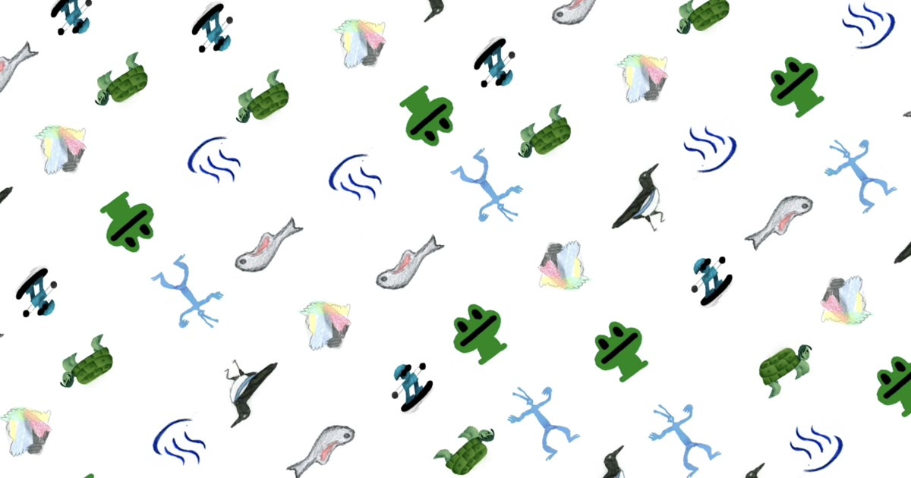

<div align="center">



# Animondo | アニm音頭

**[Play](https://x.baku89.com/animondo)** · **[Watch on YouTube](https://www.youtube.com/watch?v=3sHs7mxLkBU)**

</div>

Animondo is an animated bon-odori born from the Osaka Expo 2025 EU–Japan Animation Residency. Hand-drawn characters by the residency artists dance together to the rhythm of Kawachi Ondo. It was made as a memento of nearly a month of exchange.

## Development

Nuxt 4 (SPA) + WebGL ([regl](https://github.com/regl-project/regl)) + WebCodecs. Architecture notes live in [CLAUDE.md](CLAUDE.md).

```sh
yarn install
yarn dev       # dev server (visible on the LAN)
yarn generate  # static site into .output/public
```

## License

The source code is released under the [MIT License](LICENSE). The artists' hand-drawn animation materials (`public/sprites*`, `public/works`) and the recorded music (`public/kawachiondo_loop.*`) are **not** covered by it — all rights to those remain with their artists and performers.

---

In the framework of the Osaka Expo 2025 EU–Japan Animation Residency
Supported by the European Union
